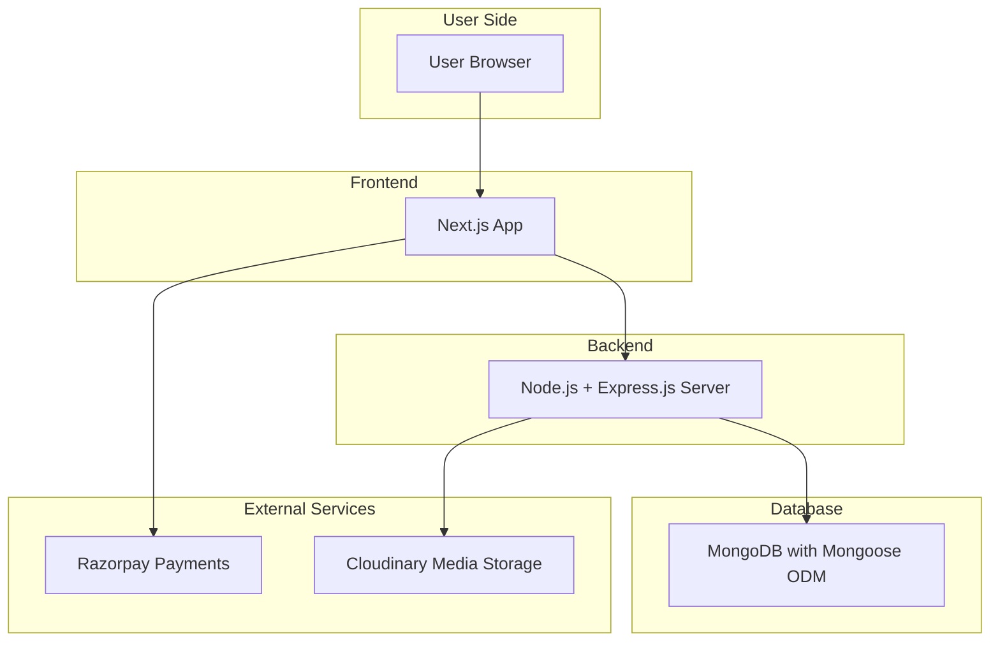

<div align="center">
  <br />
  <a href="https://zenith-acad.vercel.app" target="_blank">
    
  </a>
  <br />
  <div>
    
    
    
    
    
  </div>
  <h1>Zenith Academy</h1>
  <h3>Online Education Platform for You</h3>
  <p><a href="https://zenith-acad.vercel.app" target="_blank"><b>Check Live</b></a></p>
</div>

## 📋 Table of Contents

1. 🤖 [Introduction](#introduction)
2. ⚙️ [Tech Stack](#tech-stack)
3. 🔋 [Features](#features)
4. ⚡ [API Design](#api-design)
5. 🤝 [How to Contribute](#how-to-contribute)
<!-- 4. 🏗️ [System Architecture](#system-architecture) -->

---

## 🤖 Introduction

Zenith Academy is a fully functional ed-tech platform enabling users to create, consume, and rate educational content. Built with the MERN stack, it provides:

- A seamless and interactive learning experience for students.
- A platform for instructors to showcase expertise and connect globally.

Explore the platform: [Zenith Academy Live](https://zenith-acad.vercel.app)

---

## ⚙️ Tech Stack

| Category    | Technology | Description |
|-------------|------------|-------------|
| **Frontend** |  <br>  <br>  <br>  <br>  <br>  | Built with Next.js for SSR and performance, React 19 for UI, TypeScript for type safety, Tailwind CSS for responsive styling, Zustand for lightweight state management, and Framer Motion for animations. |
| **Backend** |  <br>  <br>  <br>  <br>  <br>  <br>  <br>  | Node.js with Express.js for server-side logic and RESTful APIs, MongoDB with Mongoose for database management, JWT and Bcrypt for authentication and security, Razorpay for payments integration, and Cloudinary for media storage. |
| **Tools & Deployment** |  <br>  <br>  | Deployed on Vercel for global delivery, using Turborepo for monorepo management and build optimization, with GitHub for version control. |

---

## 🔋 Features

Zenith Academy offers a comprehensive set of features for students and instructors to deliver an engaging online education experience.

### 🎓 For Students

- **Homepage** – Overview of the platform with featured courses and quick navigation.
- **Course List** – Browse all available courses with detailed descriptions, ratings, and instructor information.
- **Wishlist** – Add courses to your wishlist for future enrolment.
- **Cart & Checkout** – Secure cart management and payment processing with Razorpay integration.
- **Course Content** – Access enrolled course content, including videos, notes, and interactive materials.
- **Progress Tracking** – Monitor lesson completion, quiz scores, and overall course progress.
- **User Profile** – View and edit personal account details and enrolment history.


### 👨‍🏫 For Instructors

- **Instructor Dashboard** – Overview of created courses with ratings, enrolment statistics, and income tracking.
- **Course Management** – Create, update, and delete courses with multimedia content uploads via Cloudinary.
- **Insights** – View detailed analytics on course views, clicks, enrolments, and earnings.
- **Profile Management** – Edit personal and professional instructor details to maintain credibility.


### 🔧 Platform Features

- **Secure Authentication** – JWT-based login and registration with Bcrypt password hashing and role-based access.
- **Payment Integration** – Razorpay gateway for seamless and secure course purchases.
- **Responsive Design** – Mobile-first, accessible UI built with Tailwind CSS and Framer Motion animations for smooth interactions.
- **Dynamic Search & Filtering** – Efficient course search and category-based filtering for enhanced user experience.
- **RESTful APIs** – Structured APIs built with Express.js and Node.js for scalable backend operations.
- **Cloud-based Media Management** – Cloudinary integration for storing and serving course images and videos efficiently.
- **Monorepo Architecture** – Managed with Turborepo for optimized build performance and maintainability.


Zenith Academy is designed for scalability, security, and an intuitive learning experience to empower students and instructors worldwide.

---

<!-- 
### 🏗️ **System Architecture**

Zenith Academy follows a **modular, scalable client-server architecture** consisting of:

- ✅ **Frontend** – Next.js, React, Tailwind CSS, Zustand, Framer Motion
- ✅ **Backend** – Node.js, Express.js REST API
- ✅ **Database** – MongoDB with Mongoose ODM
- ✅ **Integrations** – Razorpay for payments, Cloudinary for media storage


--- -->

### 🔷 **Architecture Diagram**



---

## ⚡ API Design

Zenith Academy follows a **RESTful API architecture** using **Node.js and Express.js**, structured under `/api/v1/` with modular route grouping for scalability and clarity.

### 🔷 **Base Routes**

- `/api/v1/auth` – Authentication-related routes  
- `/api/v1/profile` – User profile management  
- `/api/v1/payment` – Payment processing routes  
- `/api/v1/course` – Course and category management routes  
- `/api/v1/contact` – Contact form submissions

### 🔐 **Authentication Routes**

| Method | Endpoint | Description |
|--------|----------|-------------|
| POST | `/login` | Authenticate user and return JWT token. |
| POST | `/signup` | Register a new user (student/instructor). |
| POST | `/sendotp` | Send OTP to user’s email for verification or reset. |
| POST | `/changepassword` | Change user password (requires auth). |
| POST | `/reset-password-token` | Generate password reset token. |
| POST | `/reset-password` | Reset password using valid token. |

### 👤 **Profile Routes**

| Method | Endpoint | Description |
|--------|----------|-------------|
| DELETE | `/deleteProfile` | Delete user account (requires auth). |
| PUT | `/updateProfile` | Update user profile details (requires auth). |
| GET | `/getUserDetails` | Fetch logged-in user’s details. |
| GET | `/getEnrolledCourses` | Get all courses enrolled by user. |
| PUT | `/updateDisplayPicture` | Update user’s display picture. |
| GET | `/getInstructorDashboardDetails` | Instructor-only dashboard analytics. |

### 💳 **Payment Routes**

| Method | Endpoint | Description |
|--------|----------|-------------|
| POST | `/capturePayment` | Capture initiated payment (student only). |
| POST | `/verifyPayment` | Verify payment signature. |
| POST | `/sendPaymentSuccessEmail` | Send payment success email to user. |

### 📚 **Course & Category Routes**

| Method | Endpoint | Description |
|--------|----------|-------------|
| POST | `/createCourse` | Create new course (instructor only). |
| POST | `/addSection` | Add section to course (instructor only). |
| POST | `/updateSection` | Update section details (instructor only). |
| POST | `/deleteSection` | Delete section (instructor only). |
| POST | `/addSubSection` | Add subsection to section (instructor only). |
| POST | `/updateSubSection` | Update subsection details (instructor only). |
| POST | `/deleteSubSection` | Delete subsection (instructor only). |
| GET | `/getAllCourses` | Retrieve all courses. |
| POST | `/getCourseDetails` | Get specific course details. |
| POST | `/getFullCourseDetails` | Get full course content (auth required). |
| POST | `/editCourse` | Edit course details (instructor only). |
| DELETE | `/deleteCourse` | Delete course (instructor only). |
| GET | `/getInstructorCourses` | Get all courses created by instructor. |
| POST | `/searchCourse` | Search courses by keyword. |
| POST | `/updateCourseProgress` | Mark lecture as completed (student only). |

### 🗂️ **Category Routes (Admin only)**

| Method | Endpoint | Description |
|--------|----------|-------------|
| POST | `/createCategory` | Create a new course category. |
| GET | `/showAllCategories` | Fetch all categories. |
| POST | `/getCategoryPageDetails` | Get category-specific course details. |
| POST | `/addCourseToCategory` | Assign course to category (instructor only). |

### 🌟 **Ratings & Reviews Routes**

| Method | Endpoint | Description |
|--------|----------|-------------|
| POST | `/createRating` | Submit course rating and review (student only). |
| GET | `/getAverageRating` | Get average rating for a course. |
| GET | `/getReviews` | Get all reviews for a course. |

### ✉️ **Contact Routes**

| Method | Endpoint | Description |
|--------|----------|-------------|
| POST | `/contactUs` | Submit contact form (name, email, message). |

---

This robust API design ensures **scalable, secure, and maintainable backend services** powering Zenith Academy’s online education ecosystem.


## 🤝 How to Contribute

We welcome contributions from the community to improve Zenith Academy. Follow these steps to get started:

### ⚡ Prerequisites

Ensure you have the following installed:

- [Git](https://git-scm.com/)
- [Node.js](https://nodejs.org/en)
- [pnpm](https://pnpm.io/)

### 📝 Steps to Contribute

##### 1. **Fork the repository**

- Click the `Fork` button at the top right of this page to create your own copy. 


##### 2. **Clone your forked repository**

```bash
git clone https://github.com/your-username/Zenith-Academy.git
cd Zenith-Academy
````

##### 3. **Install dependencies using pnpm**

```bash
pnpm install
```

##### 4. **Create a new branch for your feature or bug fix**

```bash
git checkout -b feature/YourFeatureName
```

##### 5. **Make your changes**

- Ensure your code follows the project’s coding standards and includes relevant tests if applicable.

##### 6. **Commit your changes**

```bash
git add .
git commit -m "Add YourFeatureName"
```

##### 7. **Push to your branch**

```bash
git push origin feature/YourFeatureName
```

##### 8. **Create a Pull Request**

Go to your forked repository on GitHub and click `Compare & pull request`. Add a clear description of your changes.
  
### 💡 Contribution Guidelines

- ✅ Keep PRs focused and atomic
- ✅ Write clear commit messages
- ✅ Follow existing code style and structure
- ✅ Test thoroughly before submitting

---

### 📜 Code of Conduct

This project follows a [Contributor Code of Conduct](./CODE_OF_CONDUCT.md). By participating, you agree to uphold these standards.

Thank you for contributing to **Zenith Academy**! 🙌

---

## ❤️ Contributors

<a href="https://github.com/aayushbharti/Zenith-Academy/graphs/contributors">
  
</a>

---

<p align="center">Built with ❤️ by <a href="https://github.com/AayushBharti">Aayush Bharti</a></p>
